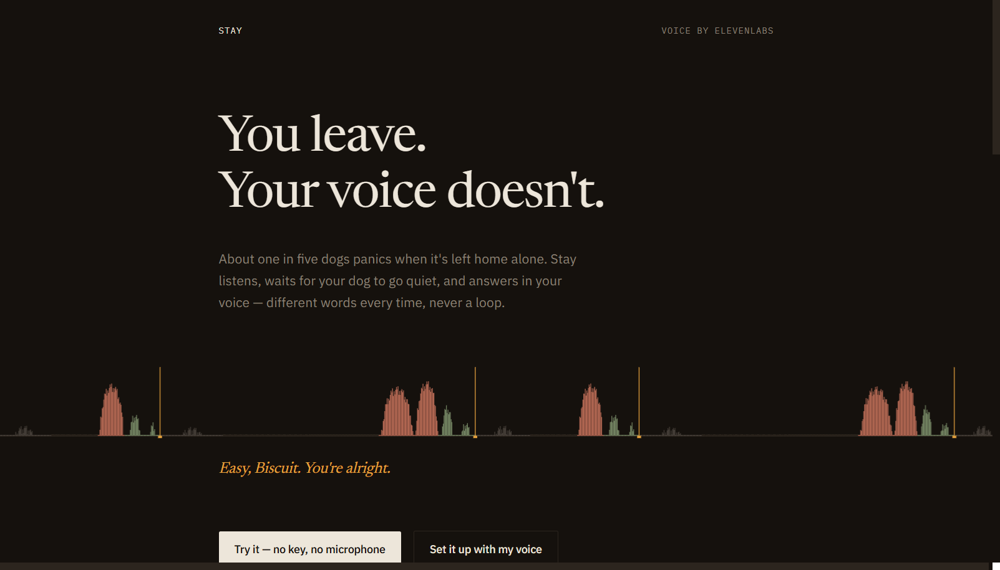
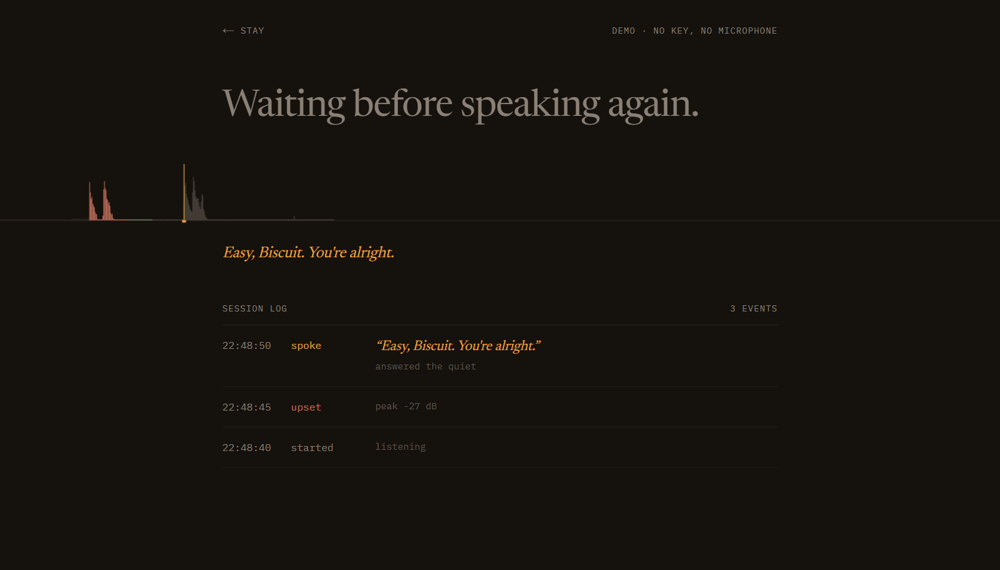
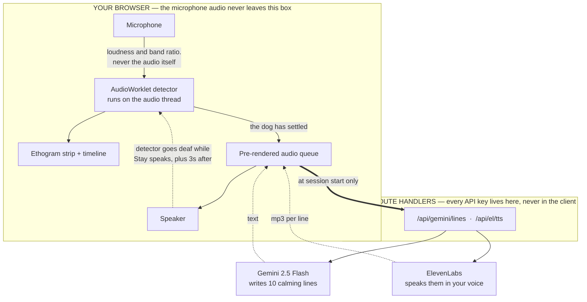
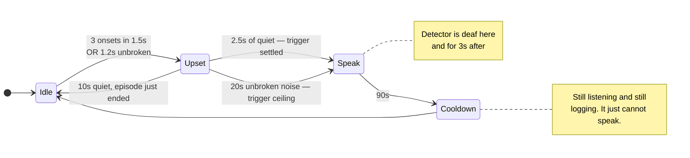
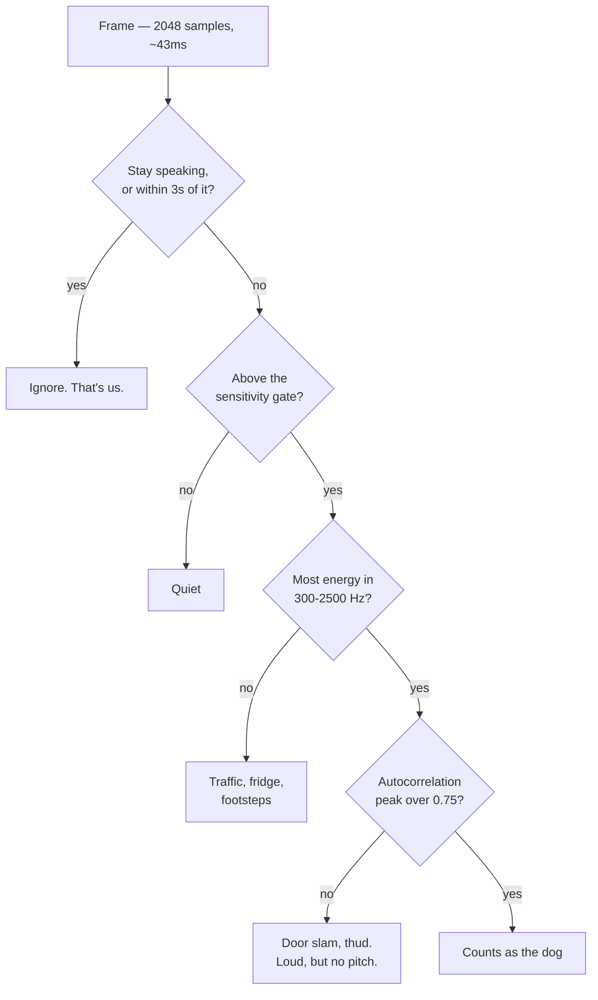
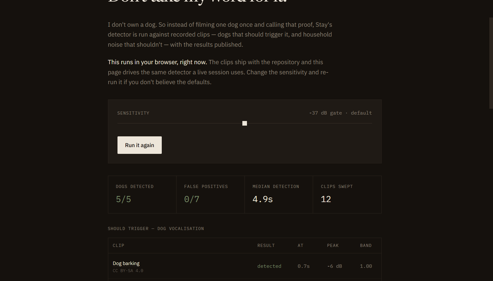
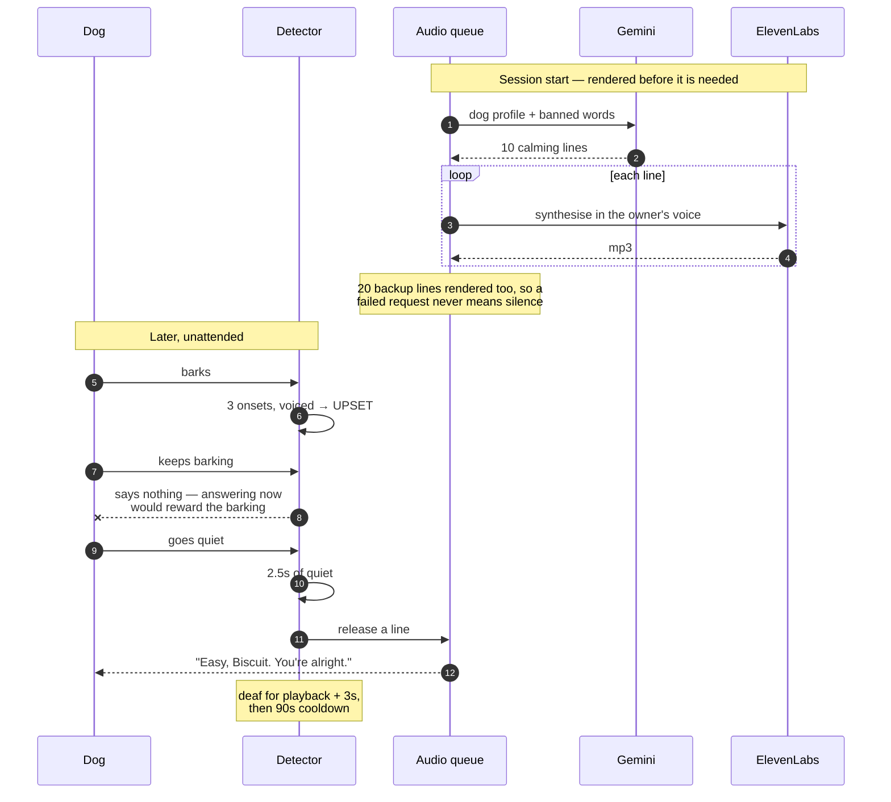
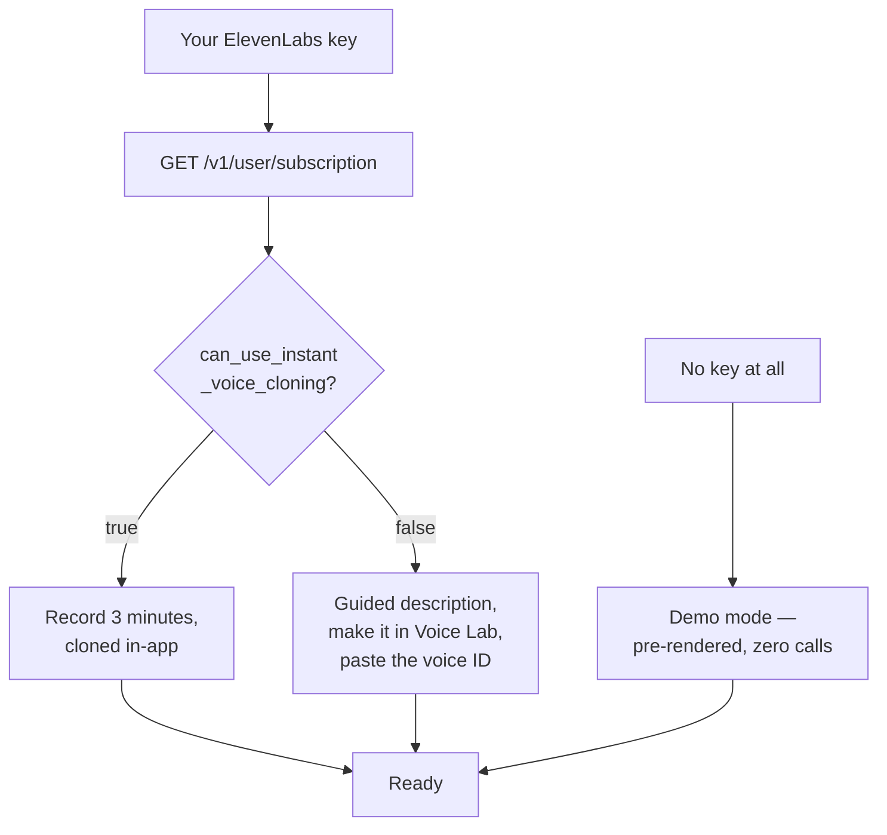

<div align="center">

# Stay

### You leave. Your voice doesn't.

Stay listens for a home-alone dog, waits for it to go quiet, and then speaks to it
in its owner's voice — different words every time, generated fresh, never a loop.

[](https://nextjs.org)
[](https://www.typescriptlang.org)
[](https://elevenlabs.io)
[](https://ai.google.dev)
[](LICENSE)

**[Demo — no key, no microphone](#running-it-locally) · [Test results](#test-results) · [Privacy](#privacy)**

</div>

---



A session is drawn as an **ethogram strip** — the horizontal band chart behavioural
scientists use to record animal behaviour over time. Quiet is a hairline. Distress
swells in clay, easing to moss as the dog settles. A single amber tick marks each time
Stay spoke. Amber appears nowhere else in the application.

Here is a real session, thirty seconds in:



Read the log from the bottom up. The dog got upset at `22:48:45`. Stay said nothing while
it was still barking. At `22:48:50`, five seconds later, the dog went quiet and *then*
Stay spoke — the log records the reason as **"answered the quiet."**

That gap is the entire product.

---

## Why

A [survey of 3,284 dogs](https://www.sciencedirect.com/science/article/pii/S1558787816300569)
put separation anxiety at **17.2%** — roughly one dog in six.

In 2021 a Finnish app called Digital Dogsitter was
[put through a proper trial](https://www.sciencedirect.com/science/article/pii/S0168159121002471).
It listened for the dog crying and played back a short recording of the owner's voice.
Across 40 dogs, total vocalisation dropped by **95.7%** after two weeks (P&nbsp;<&nbsp;0.001).
At an eight-month follow-up, 68.7% of the owners who replied still felt it was helping.
*(Tiira, Applied Animal Behaviour Science 243:105460.)*

The mechanism isn't a hunch. It's published.

But the same literature carries a warning: **a single clip, looped identically, can flip
from comfort into a cue** — the sound that means you're gone. In 2021 there was no way
around that, because you could only play back what you had already recorded.

Stay is the version where the voice can say things it never said.

---

## How it fits together

Everything that touches a third-party key runs server-side. The microphone never does.



**The dotted line is the most important one in the diagram.** Stay plays audio out of the
same speaker its microphone is listening to. Without an interlock that deafens the
detector while it speaks — plus a three-second tail — the app hears itself, decides the
dog is upset, and talks to itself forever. That happens about five seconds into the
first demo.

---

## The decision I'm proudest of: it answers the quiet, not the noise

If the voice arrives the instant the dog barks, you've built a machine that **rewards
barking**. The dog learns barking summons its human, and you've trained the exact
behaviour you were trying to reduce.

So Stay marks the dog as upset, keeps listening, and releases a response only after
2.5 seconds of quiet.



With one exception. If the dog **never** settles, Stay speaks anyway after 20 seconds —
an inconsolable dog shouldn't be ignored for failing to meet a threshold. The timeline
records which rule fired, so *"your dog settled and was answered"* is distinguishable
from *"your dog never settled and was answered anyway."*

About fifteen lines of code, and it's the difference between a comfort device and a bark
trainer.

---

## How the detector decides

Four tests, cheapest first. Most frames in a quiet house never get past the second.



| # | Test | Why |
|---|---|---|
| 1 | Not Stay's own voice | The feedback interlock |
| 2 | Above the sensitivity gate | Cheap first filter |
| 3 | Energy in **300–2500 Hz** | Where barks and whines live |
| 4 | **Voiced** — autocorrelation > 0.75 | The one that matters indoors |

Then, on top: three separate onsets inside 1.5&nbsp;s (barking repeats) **or** 1.2&nbsp;s
unbroken (whining sustains).

### Two things I got badly wrong

**The first detector never fired at all.** I wrote the obvious rule — loud, in-band, held
for 400&nbsp;ms. Against a 40-second recording of a barking dog it produced two log
entries: started, ended.

Instrumenting rather than guessing:

```
frames 497 · loud 37 · in-band 174 · both 37
longest unbroken noisy run: 6 frames    rule required: 10
```

Barking is *impulsive* — bursts of 150–250&nbsp;ms with gaps. It never produces 400&nbsp;ms
of continuous sound. **I had designed for a noise dogs don't make.**

**Then it fired on everything.** Four of seven household clips triggered it — every
substantial door slam. A slam is loud, in the same frequency band, and made of several
separated transients. On those three axes it genuinely *is* a bark.

What separates them is that **a bark is voiced.** It has a pitch, so the waveform repeats.
A slam is a broadband transient with no periodicity at all.

```
                 loud?   in band?   voiced?
  bark             yes      yes        yes
  whine            yes      yes        yes
  door slam        yes      yes        no    <- the discriminator
  traffic          yes      no         no
  fridge hum       no       no         no
```

No model, no download, nothing leaves the device.

---

## Test results

I don't own a dog. So rather than film one dog once and call it proof, the detector runs
against recorded clips and **the numbers are published, with the clips in the repo so you
can re-run the sweep yourself** at `/test`.



Shipped defaults, sensitivity 0.5:

| | |
|---|---|
| Dog clips detected | **5 / 5** |
| Dog clips that produced a spoken response | **5 / 5** |
| Household-noise clips that triggered it | **0 / 7** |

How the voicing threshold was chosen:

| threshold | dogs | false positives |
|---|---|---|
| 0.30 | 5/5 | 5/7 |
| 0.50 | 4/5 | 1/7 |
| 0.65 | 5/5 | 1/7 |
| **0.75** | **5/5** | **0/7** |
| 0.80 | 5/5 | 0/7 |

0.75 and 0.80 both sweep clean, so 0.75 was taken as the middle of the plateau rather
than its edge. The last clip to hold out was a *squeaking* door — a hinge squeak
genuinely has a pitch, which is exactly what this test looks for.

> [!IMPORTANT]
> **The threshold was tuned on these same clips**, so these numbers flatter it. The
> honest test is a larger set the detector has never seen, which I didn't have time to
> assemble. Treat 0/7 as *"the idea works"*, not as a measured false-positive rate.

Full per-clip results in **[docs/TEST-RESULTS.md](docs/TEST-RESULTS.md)**. Every clip's
source and licence in **[public/test-audio/SOURCES.md](public/test-audio/SOURCES.md)**.

---

## A session, end to end



Generating a line and synthesising it *after* the dog settles costs two to six seconds —
the moment is gone. So Stay renders everything up front, and playback is a decoded buffer
that starts instantly.

---

## Running on a free ElevenLabs account

I had no budget, so the first thing I did was ask a free key what it could actually do.
Less than the docs suggest:

```
TTS with a library voice  → 402  "Free users cannot use library voices via the API"
Voice Design via the API  → 403  "Creating a voice through the API is only available
                                  on a paid plan"
```

But a voice you create yourself in ElevenLabs' dashboard is a *personal* voice, not a
library one — and driving that through the API works fine. So Stay asks the key what it's
allowed to do, and adapts:



Three complete paths instead of one crippled one. **Stay runs on a free ElevenLabs
account**, never asks you for money, and never stores your key.

---

## Running it locally

```bash
git clone https://github.com/vighriday/stay-for-dogs.git
cd stay-for-dogs
npm install
cp .env.example .env.local     # add GEMINI_API_KEY
npm run dev
```

Then open <http://localhost:3000/demo> — **it needs no keys at all.**

| Variable | Needed for |
|---|---|
| `GEMINI_API_KEY` | Writing calming lines, scoring clips. [Free tier](https://aistudio.google.com/apikey). |
| `ELEVENLABS_API_KEY` | Only `scripts/build-demo-audio.mjs`, which pre-renders demo audio. |
| `STAY_DEMO_VOICE_ID` | Same script. |

Users bring their **own** ElevenLabs key through the UI. It lives in their browser, is
sent per request, and is never stored server-side.

---

## Project structure

```
app/
├── page.tsx              landing — the strip is the hero
├── setup/                key → capability branch → voice → dog profile
├── session/              Away Mode: strip, state line, timeline
├── demo/                 real detector, real clip, no key, no mic
├── test/                 the sweep you can re-run yourself
├── review/               Gemini clip scoring + vocal classification
├── privacy/              a straight answer about the microphone
└── api/
    ├── el/               capabilities · voice · tts · clone
    └── gemini/           lines · score · vocal

lib/
├── audio/
│   ├── graph.ts          live mic graph + wake lock
│   ├── offline.ts        same detector, recorded audio
│   └── voice.ts          pre-render queue + offline bank
├── elevenlabs.ts         server-side, typed errors
├── gemini.ts             prompts + server-side line validation
└── types.ts              every detector constant, with the reasoning

public/
├── stay-detector.worklet.js   the detector itself
├── demo/                      pre-rendered demo audio
└── test-audio/                the clips, with SOURCES.md
```

---

## Privacy

**The microphone audio never leaves your browser.** Stay measures how loud the room is
and how much of that sits in the dog band — both computed on-device, on the audio thread.
Nothing is recorded, buffered to disk, or uploaded.

That's a property of how it's built rather than a promise: there is no code path that
sends microphone data anywhere. The full answer, including how your API key is handled,
is at `/privacy`.

---

## Honest limitations

- **A prototype, not a treatment.** A badly anxious dog needs a veterinary behaviourist.
- **I don't own a dog.** Everything is tested against recorded clips, which is why the
  numbers are published rather than asserted.
- **The threshold was tuned on the test set.** See the note above.
- **The test set is small and skewed** — twelve clips, and six of the seven controls are
  doors, because that is what was freely licensed and redistributable.
- **No room in the measurement.** Clips go straight into the audio graph: no speaker, no
  microphone, no distance, no reverb. Real rooms are harder — hence the sensitivity slider.
- **Loud, genuinely pitched sounds still get through.** A smoke alarm chirp is a tone and
  would probably trigger it. Judging by periodicity rather than by what the sound *is*
  has a ceiling.
- **No before-and-after demo, and no fake one.** A real comparison needs the same dog in
  two states; no stock library has a matched pair. The compare flow is there for *you*.
- **Behaviour scores come from a general-purpose vision model** watching a short clip.
  A structured second opinion, not a measurement.

---

## Build window

Everything here was written between **14 August 2026, 02:00 UTC** and the challenge
deadline of **17 August 2026, 06:59 UTC**, for the
[DEV Weekend Challenge: Dog Days Edition](https://dev.to/challenges/weekend-2026-08-13).

The commit history is incremental and the messages say what changed and why — including
both occasions where a measurement proved the design wrong and the design had to move.
Narrative version in **[docs/BUILD-LOG.md](docs/BUILD-LOG.md)**.

## Licence

Code is [MIT](LICENSE). Audio under `public/test-audio/` and `public/demo/` keeps its
original licences — see [SOURCES.md](public/test-audio/SOURCES.md).
