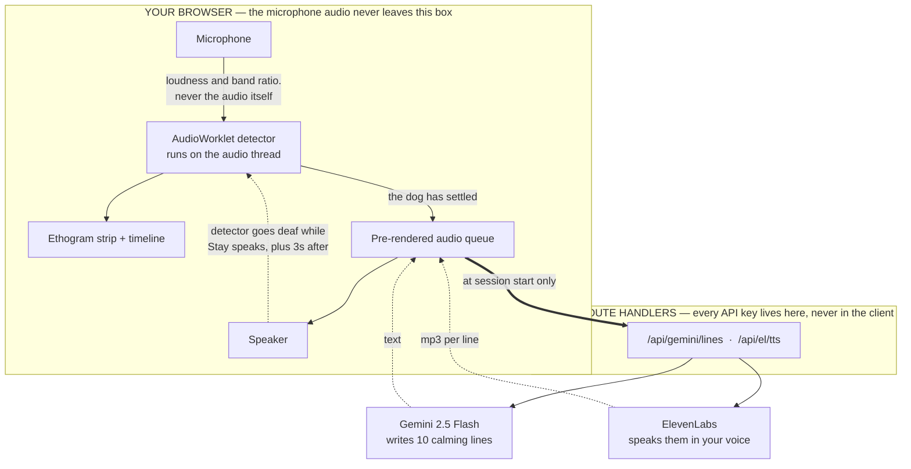
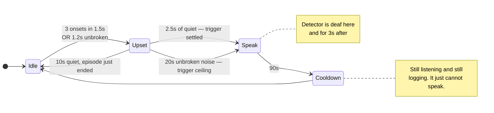
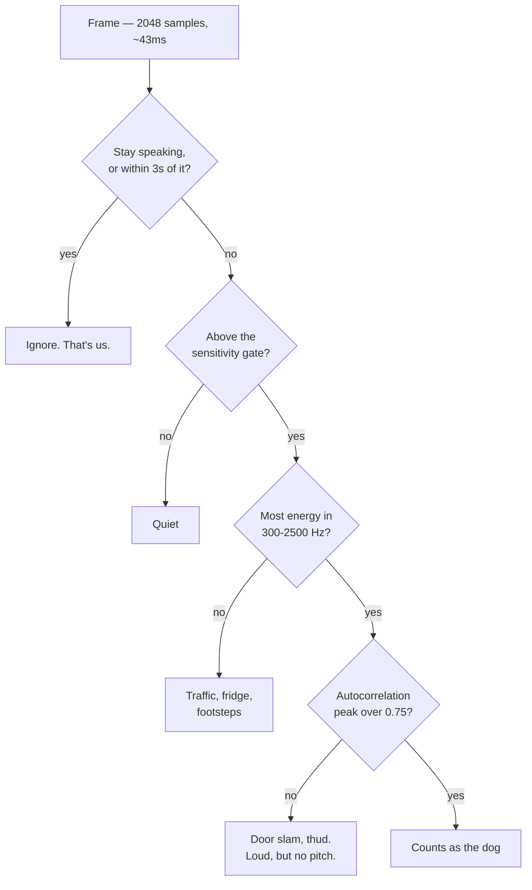
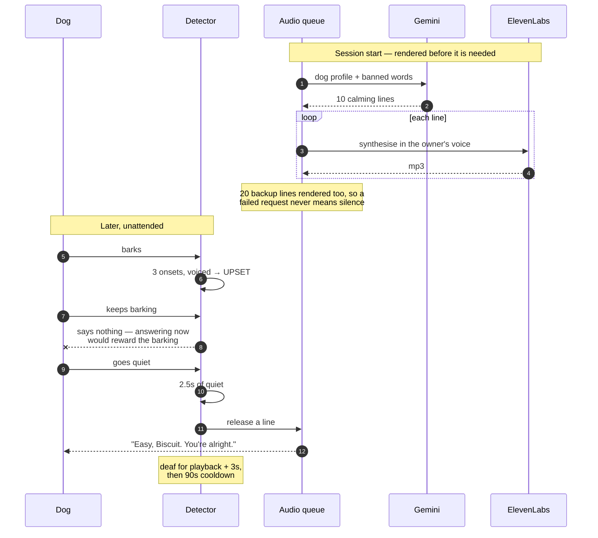
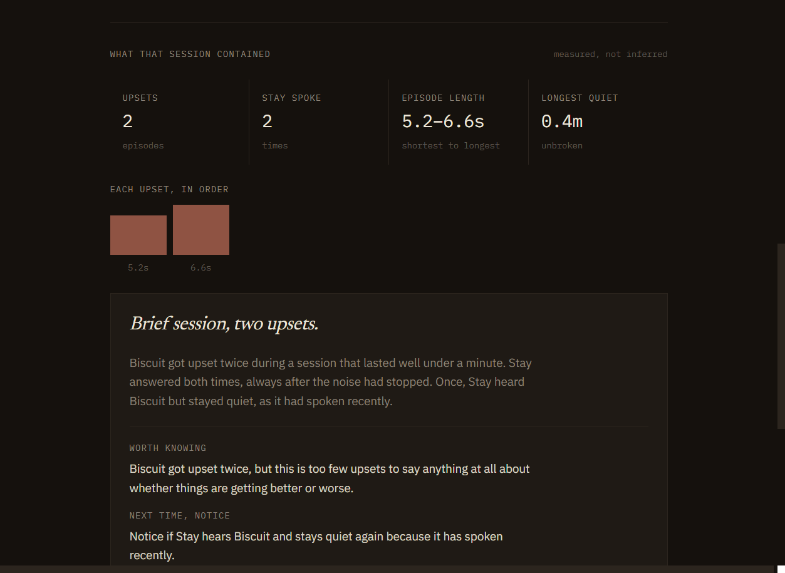
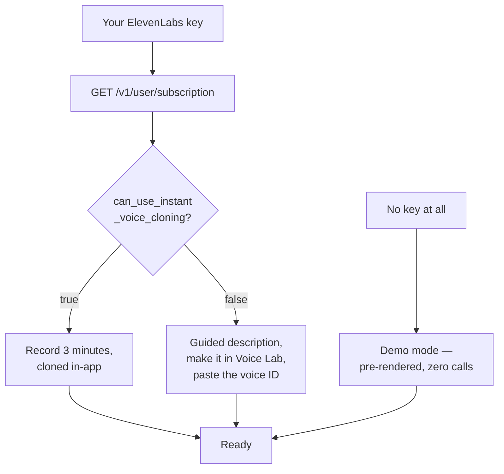

<div align="center">

# Stay

### You leave. Your voice doesn't.

Stay listens for a home-alone dog, waits for it to go quiet, and then speaks to it
in its owner's voice — different words every time, generated fresh, never a loop.

[](https://nextjs.org)
[](https://www.typescriptlang.org)
[](https://elevenlabs.io)
[](https://ai.google.dev)
[](LICENSE)
[](https://github.com/vighriday/stay-for-dogs/actions/workflows/verify.yml)

### [**Try it live →**](https://stay-swart.vercel.app)

**[Demo — no key, no microphone](https://stay-swart.vercel.app/demo) · [Re-run the detector tests](https://stay-swart.vercel.app/test) · [Privacy](https://stay-swart.vercel.app/privacy)**

</div>

---


A session is drawn as an **ethogram strip** — the horizontal band chart behavioural
scientists use to record animal behaviour over time. Quiet is a hairline. Distress
swells in clay, easing to moss as the dog settles. A single amber tick marks each time
Stay spoke. Amber appears nowhere else in the application.

Here is a real session, thirty seconds in:


Read the log from the bottom up. The dog got upset at `22:48:45`. Stay said nothing while
it was still barking. At `22:48:50`, five seconds later, the dog went quiet and *then*
Stay spoke — the log records the reason as **"answered the quiet."**

That gap is the entire product.

---

## Why

A [survey of 3,284 dogs](https://www.sciencedirect.com/science/article/pii/S1558787816300569)
put separation anxiety at **17.2%** — roughly one dog in six.

In 2021 a Finnish app called Digital Dogsitter was
[put through a proper trial](https://www.sciencedirect.com/science/article/pii/S0168159121002471).
It listened for the dog crying and played back a short recording of the owner's voice.
Across 40 dogs, total vocalisation dropped by **95.7%** after two weeks (P&nbsp;<&nbsp;0.001).
At an eight-month follow-up, 68.7% of the owners who replied still felt it was helping.
*(Tiira, Applied Animal Behaviour Science 243:105460.)*

The mechanism isn't a hunch. It's published.

But the same literature carries a warning: **a single clip, looped identically, can flip
from comfort into a cue** — the sound that means you're gone. In 2021 there was no way
around that, because you could only play back what you had already recorded.

Stay is the version where the voice can say things it never said.

---

## How it fits together

Everything that touches a third-party key runs server-side. The microphone never does.



**The dotted line is the most important one in the diagram.** Stay plays audio out of the
same speaker its microphone is listening to. Without an interlock that deafens the
detector while it speaks — plus a three-second tail — the app hears itself, decides the
dog is upset, and talks to itself forever. That happens about five seconds into the
first demo.

---

## The decision I'm proudest of: it answers the quiet, not the noise

If the voice arrives the instant the dog barks, you've built a machine that **rewards
barking**. The dog learns barking summons its human, and you've trained the exact
behaviour you were trying to reduce.

So Stay marks the dog as upset, keeps listening, and releases a response only after
2.5 seconds of quiet.



With one exception. If the dog **never** settles, Stay speaks anyway after 20 seconds —
an inconsolable dog shouldn't be ignored for failing to meet a threshold. The timeline
records which rule fired, so *"your dog settled and was answered"* is distinguishable
from *"your dog never settled and was answered anyway."*

About fifteen lines of code, and it's the difference between a comfort device and a bark
trainer.

---

## How the detector decides

Four tests, cheapest first. Most frames in a quiet house never get past the second.



| # | Test | Why |
|---|---|---|
| 1 | Not Stay's own voice | The feedback interlock |
| 2 | Above the sensitivity gate | Cheap first filter |
| 3 | Energy in **300–2500 Hz** | Where barks and whines live |
| 4 | **Voiced** — autocorrelation > 0.75 | The one that matters indoors |

Then, on top: three separate onsets inside 1.5&nbsp;s (barking repeats) **or** 1.2&nbsp;s
unbroken (whining sustains).

### Four things I got badly wrong

**The first detector never fired at all.** I wrote the obvious rule — loud, in-band, held
for 400&nbsp;ms. Against a 40-second recording of a barking dog it produced two log
entries: started, ended.

Instrumenting rather than guessing:

```
frames 497 · loud 37 · in-band 174 · both 37
longest unbroken noisy run: 6 frames    rule required: 10
```

Barking is *impulsive* — bursts of 150–250&nbsp;ms with gaps. It never produces 400&nbsp;ms
of continuous sound. **I had designed for a noise dogs don't make.**

**Then it fired on everything.** Four of seven household clips triggered it — every
substantial door slam. A slam is loud, in the same frequency band, and made of several
separated transients. On those three axes it genuinely *is* a bark.

What separates them is that **a bark is voiced.** It has a pitch, so the waveform repeats.
A slam is a broadband transient with no periodicity at all.

**And then I was wrong a third time.** That fix scored 5/5 and 0/7 — on the twelve clips
I had tuned it against. Adding twenty-two clips it had never seen dropped it to 5/9 and
4/13. The perfect score was overfitting, and I only found out because I went looking.

```
                 loud?   in band?   voiced?
  bark             yes      yes        yes
  whine            yes      yes        yes
  door slam        yes      yes        no    <- the discriminator
  traffic          yes      no         no
  fridge hum       no       no         no
  human speech     yes      yes        YES   <- and here is the ceiling
```

No model, no download, nothing leaves the device. But speech has exactly the same
signature as a bark, and no amount of threshold work fixes that. Identifying *what made
a sound* rather than *what shape it is* needs a classifier — that's the next thing to
build, and it's where the honest numbers below run out.

**The fourth was not in the detector at all**, and I found it by writing a test rather
than by running one: the banned-word filter let *"we are going walking soon"* through to
the speaker. [Below](#the-rest-of-the-tests-exist-because-of-a-bug-i-shipped).

---

## Test results

I don't own a dog. So rather than film one dog once and call it proof, the detector runs
against recorded clips and **the numbers are published, with the clips in the repo so you
can re-run the sweep yourself** at [https://stay-swart.vercel.app/test](https://stay-swart.vercel.app/test).


I tuned the detector against an initial 12 clips and it scored perfectly: **5/5 dogs,
0/7 false positives.** Then I added 22 clips it had never seen — different source,
including whimpering, crying and yelping, plus household sounds the first set lacked
like conversation, a washing machine and a smoke alarm.

| | Tuned-on (12) | **Held-out (22)** |
|---|---|---|
| Dogs detected | 5 / 5 | **5 / 9** |
| False positives | 0 / 7 | **4 / 13** |

> [!IMPORTANT]
> **The perfect score was overfitting.** On audio it had never met, the detector finds
> 56% of dogs and false-alarms on 31% of household noise. That second column is the real
> number, because it's the only one that describes what happens to somebody who isn't me.

Across all 34 clips: **10/14 dogs, 4/20 false positives.**

### The limitation that matters

One of the false alarms is a recording of people talking. **Human speech is the most
voiced sound there is**, and it sits right inside 300–2500 Hz — so the voicing test
can't tell a person from a dog, which means *a television left on will trigger Stay.*
In a home, that isn't an edge case.

The obvious fix works and I rejected it. Raising the pitch floor from 140 Hz to 300 Hz
(adult speech is 85–255 Hz, dogs sit above) removes that false alarm — but it costs a
**whining** clip, and whining is the single most characteristic sound of separation
distress. Missing a distressed dog is the product failing at its purpose; speaking when
it shouldn't is annoying and capped at once per 90 s by the cooldown.

So 140 Hz ships, deliberately, and the worse-looking table ships with it.

Full per-clip breakdown, the threshold sweeps, and what each miss has in common:
**[docs/TEST-RESULTS.md](docs/TEST-RESULTS.md)**. Every clip's source and licence:
**[public/test-audio/SOURCES.md](public/test-audio/SOURCES.md)** — 22 CC0 clips from
Freesound, 12 from Wikimedia Commons.

---

## A session, end to end



Generating a line and synthesising it *after* the dog settles costs two to six seconds —
the moment is gone. So Stay renders everything up front, and playback is a decoded buffer
that starts instantly.

---

## Reading the session back — and the number Gemini is never shown

A session leaves behind something no camera produces: a behavioural record of a dog that
was alone. When each upset started, how long it ran, how loud it peaked, how the episodes
compared. That is the thing an owner actually wants, and as a list of timestamps it is
unreadable.



**The interesting part is what the model is not given.**

The first version handed Gemini the figures with a prompt telling it not to recite them.
It recited them anyway — every time, dBFS units and all:

> Biscuit got upset 3 times during the 42.5 minute session. The upsets lasted 14.2, 9.6
> and 4.8 seconds, with peak volumes of -19 dBFS, -23 dBFS and -28 dBFS.

That is the table read aloud. Instructing a model to ignore what is in front of it is not
a design, so the numbers were removed instead. `describeSession()` turns the timestamps
into statements that are already true, and those sentences are the entire prompt input:

```
The session lasted about 45 minutes.
The dog got upset three times.
Each upset was shorter than the one before it.
The upsets also got quieter as the session went on.
There was one long stretch of about 20 minutes with nothing at all.
Stay answered every upset.
Every answer came after the noise had already stopped, never during it.
```

Which becomes:

> **Three upsets, getting shorter and quieter**
>
> Biscuit got upset three times during the session, which lasted about 45 minutes. Each
> upset became shorter and quieter as the session went on, and there was a long, quiet
> stretch in the middle. Stay answered every upset, always after the noise had already
> stopped.
>
> *Worth knowing —* The upsets did get shorter and quieter, but three of them is a thin
> basis for believing that means very much yet.

**A model cannot misreport a number it was never shown.** Whether a direction may be
described at all is decided on the server from the episode count — under three upsets and
the prompt is told outright that no trend exists. That is a rule in code, not a line in a
prompt that a helpful model can talk itself past. The page shows the exact input under a
disclosure, so this is checkable rather than claimed.

It also reports sessions that got *worse*, in the same plain language. There would be no
point otherwise.

**One bug this caught in my own code:** loudness direction was first computed as a ratio
of dBFS values. Decibels are logarithmic and negative, so `-28 / -19` is not a ratio of
anything — and a dog that was getting quieter was reported as getting louder. It is a
difference test with a 4 dB floor now.

This runs on the shared Gemini key, so **demo mode gets it too, with no key of any kind.**

---

## Running on a free ElevenLabs account

I had no budget, so the first thing I did was ask a free key what it could actually do.
Less than the docs suggest:

```
TTS with a library voice  → 402  "Free users cannot use library voices via the API"
Voice Design via the API  → 403  "Creating a voice through the API is only available
                                  on a paid plan"
```

But a voice you create yourself in ElevenLabs' dashboard is a *personal* voice, not a
library one — and driving that through the API works fine. So Stay asks the key what it's
allowed to do, and adapts:



Three complete paths instead of one crippled one. **Stay runs on a free ElevenLabs
account**, never asks you for money, and never stores your key.

---

## The detector runs in CI, with no browser and no audio files

The detector is written against the AudioWorklet API, so it could only ever run inside a
page. That left the one component whose worst failure mode is *silence* with no automated
check — and that isn't hypothetical. **The first version detected nothing on a real
barking dog and looked perfectly healthy doing it.**

The worklet is only a class. It touches three globals — `AudioWorkletProcessor`,
`registerProcessor`, `sampleRate` — so shimming those runs it unmodified under Node.
**These tests drive the exact file the browser loads**, not a port of it. The band-passed
second input comes from the same filter design the live graph builds.

The signals are generated in code, each shaped to isolate one rule:

| Signal | Asserts |
|---|---|
| Three voiced bursts | An episode opens |
| One burst, then two | It doesn't — a bang is an event, not a pattern |
| Four loud broadband transients | Still nothing. **The door-slam case that justified the voicing gate** |
| A sustained tone | Opens via the continuous route — whining, not barking |
| Noise that never stops | Silent throughout, then answers the quiet afterwards |
| 22 s unbroken | Answered anyway, on the ceiling rule |
| A second episode inside 90 s | Logged as `held`, not answered |
| Faint barking at two sensitivities | The slider really does move the operating point |

The last test asserts that **a speech-shaped signal still triggers it** — the documented
limitation, written down as an assertion so it can't be quietly "fixed" without someone
noticing that the whining case went with it.

Building it taught me something: my first synthetic "speech" was a bass-heavy tone, and it
*didn't* trigger — a 300 Hz highpass strips a 150 Hz fundamental. Real speech carries its
energy in the **formants**, inside the dog band. Modelling it wrong would have made the
limitation vanish from the test bench while leaving it in the product.

**`/test` measures how often the detector is right. This measures why.**

---

## The rest of the tests exist because of a bug I shipped

Every test in this repo is a regression test for something that actually went wrong.

```bash
npm run verify     # types, lint, 94 tests
```

**No test framework.** Node 22's built-in runner and native TypeScript stripping mean the
dependency count is still five.

Two of the bugs were found by writing the tests, not by the tests later:

**The banned-word list only blocked exact words.** The prompt tells the model *"never use
any word from the banned list, in any form, including inside other words."* The validator
matched `\bwalk\b`. So:

```
BLOCKED   Time for a walk
PASSES    We are going walking soon      ← would have been spoken aloud
PASSES    She walked away
PASSES    Two walks today
```

*Walk* is the most reactive word in the list, and three of its four forms went straight
through. Matching a bare prefix would have been worse — `car` would swallow *carpet* and
*careful* — so it now matches a short set of real inflections. There's a test asserting a
dog named **Walker** is still called by its name.

**Questions were only caught by punctuation.** `"Are you alright in there"` has no question
mark, so it passed. It's still a question to a dog, and a question makes a dog get up.

The third is the one from the session summary: **loudness direction computed as a ratio of
dBFS values.** Decibels are logarithmic and negative, so `-28 / -19` is not a ratio of
anything, and a dog getting quieter was reported as getting louder.

Also asserted: the twenty offline bank lines all pass the validator — *the safety net must
not itself be a hazard* — and the detector's tuned constants stay coherent with each other,
because the first version of this detector failed silently rather than loudly.

---

## Running it locally

```bash
git clone https://github.com/vighriday/stay-for-dogs.git
cd stay-for-dogs
npm install
cp .env.example .env.local     # add GEMINI_API_KEY
npm run dev
```

Then open <http://localhost:3000/demo> — **it needs no keys at all.**

Or skip all of that and use the deployed one: <https://stay-swart.vercel.app/demo>

| Variable | Needed for |
|---|---|
| `GEMINI_API_KEY` | Writing calming lines, scoring clips. [Free tier](https://aistudio.google.com/apikey). |
| `ELEVENLABS_API_KEY` | Only `scripts/build-demo-audio.mjs`, which pre-renders demo audio. |
| `STAY_DEMO_VOICE_ID` | Same script. |

Users bring their **own** ElevenLabs key through the UI. It lives in their browser, is
sent per request, and is never stored server-side.

---

## Project structure

```
app/
├── page.tsx              landing — the strip is the hero
├── setup/                key → capability branch → voice → dog profile
├── session/              Away Mode: strip, state line, timeline
├── demo/                 real detector, real clip, no key, no mic
├── test/                 the sweep you can re-run yourself
├── review/               Gemini clip scoring + vocal classification
├── privacy/              a straight answer about the microphone
└── api/
    ├── el/               capabilities · voice · tts · clone
    └── gemini/           lines · score · vocal · session

components/
└── SessionReport.tsx     the closing summary, and its exact model input

test/
├── harness.ts            AudioWorklet shim + signal generators
├── detector.test.ts      the real worklet, driven in Node
├── lineRules.test.ts     what may be said to a dog
├── sessionStats.test.ts  timestamps → statements
└── detectorConfig.test.ts constants that must stay coherent

lib/
├── audio/
│   ├── graph.ts          live mic graph + wake lock
│   ├── offline.ts        same detector, recorded audio
│   └── voice.ts          pre-render queue + offline bank
├── sessionStats.ts       timestamps → numbers → plain statements
├── elevenlabs.ts         server-side, typed errors, per-mood delivery
├── gemini.ts             prompts + server-side line validation
└── types.ts              every detector constant, with the reasoning

public/
├── stay-detector.worklet.js   the detector itself
├── demo/                      pre-rendered demo audio
└── test-audio/                the clips, with SOURCES.md
```

---

## Privacy

**The microphone audio never leaves your browser.** Stay measures how loud the room is
and how much of that sits in the dog band — both computed on-device, on the audio thread.
Nothing is recorded, buffered to disk, or uploaded.

That's a property of how it's built rather than a promise: there is no code path that
sends microphone data anywhere. The full answer, including how your API key is handled,
is at [https://stay-swart.vercel.app/privacy](https://stay-swart.vercel.app/privacy).

---

## Honest limitations

- **A prototype, not a treatment.** A badly anxious dog needs a veterinary behaviourist.
- **I don't own a dog.** Everything is tested against recorded clips, which is why the
  numbers are published rather than asserted.
- **Held-out performance is 56% detection, 31% false alarms.** The perfect score was
  overfitting; the honest number is in the table above.
- **A television will trigger it.** Human speech is voiced and in-band, and the voicing
  test cannot tell a person from a dog.
- **The test set is 34 clips**, which is small, and every clip is a clean recording of a
  single thing. Real rooms layer sounds; a dog whining over a washing machine is not
  represented at all.
- **No room in the measurement.** Clips go straight into the audio graph: no speaker, no
  microphone, no distance, no reverb. Real rooms are harder — hence the sensitivity slider.
- **Loud, genuinely pitched sounds still get through.** A smoke alarm chirp is a tone and
  would probably trigger it. Judging by periodicity rather than by what the sound *is*
  has a ceiling.
- **No before-and-after demo, and no fake one.** A real comparison needs the same dog in
  two states; no stock library has a matched pair. The compare flow is there for *you*.
- **Behaviour scores come from a general-purpose vision model** watching a short clip.
  A structured second opinion, not a measurement.

---

## Build window

Everything here was written between **14 August 2026, 02:00 UTC** and the challenge
deadline of **17 August 2026, 06:59 UTC**, for the
[DEV Weekend Challenge: Dog Days Edition](https://dev.to/challenges/weekend-2026-08-13).

The commit history is incremental and the messages say what changed and why — including
both occasions where a measurement proved the design wrong and the design had to move.
Narrative version in **[docs/BUILD-LOG.md](docs/BUILD-LOG.md)**.

## Licence

Code is [MIT](LICENSE). Audio under `public/test-audio/` and `public/demo/` keeps its
original licences — see [SOURCES.md](public/test-audio/SOURCES.md).
